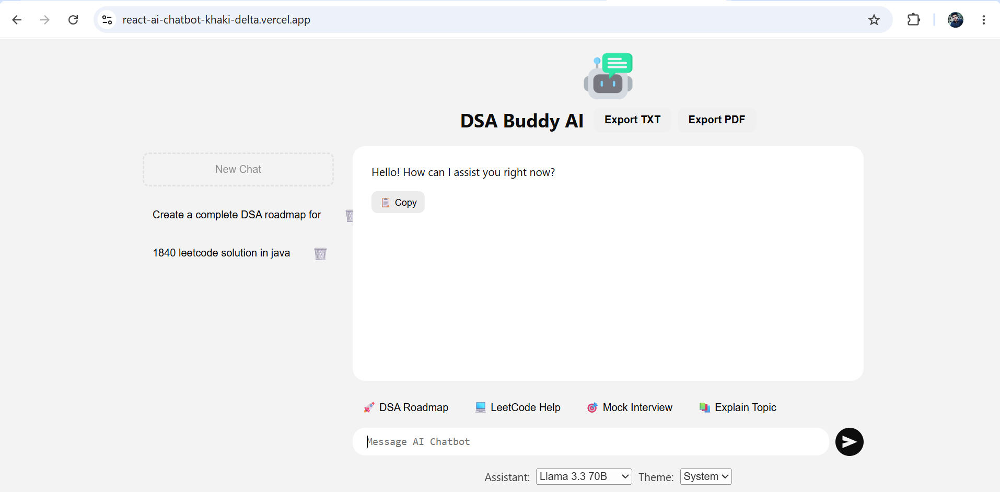
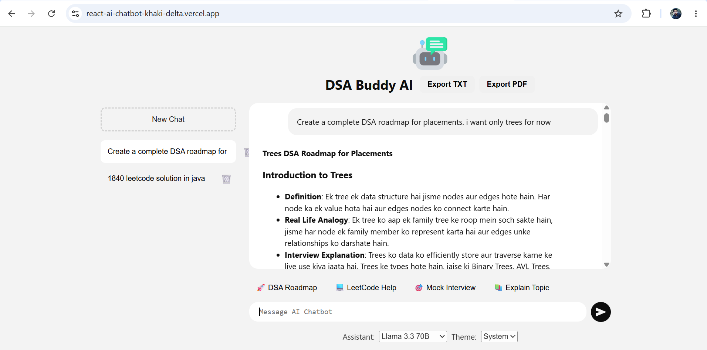
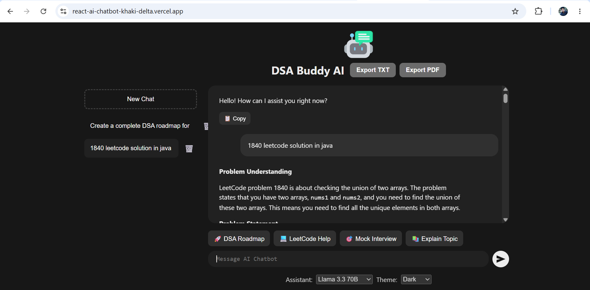
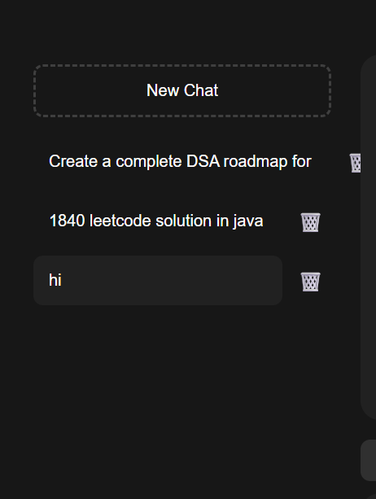

# 🚀 DSA Buddy AI

An AI-powered DSA learning assistant built using React, Vite, and Groq's OpenAI-compatible API. It helps students understand Data Structures & Algorithms through structured explanations, interview-oriented guidance, mock interviews, and interactive conversations.

---

# 🌐 Live Demo

👉 https://react-ai-chatbot-git-main-abhay-chaudharys-projects-2e26b5fb.vercel.app/

---

# 📸 Screenshots

### 🏠 Home



---

### 💬 AI Chat



---

### 🌙 Dark Theme



---

### 🗂️ Multi Chat



---

# 📖 About The Project

DSA Buddy AI is designed to make learning Data Structures and Algorithms easier by combining modern AI with an intuitive user interface.

The assistant explains concepts in a structured format, provides interview-focused guidance, helps solve LeetCode problems, conducts mock interviews, and generates detailed explanations with complexity analysis.

The application supports multiple chat sessions, persistent chat history, streaming AI responses, PDF/TXT export, and responsive UI for desktop and mobile devices.

---

# ✨ Features

## 🤖 AI-Powered DSA Mentor

- Structured DSA explanations
- Brute Force → Better → Optimal approach
- Time Complexity Analysis
- Space Complexity Analysis
- Interview-Oriented Guidance
- Hinglish-friendly explanations

---

## 💬 Multi Chat Support

- Create Multiple Chats
- Switch Between Conversations
- Delete Individual Chats
- Persistent Chat History using Local Storage

---

## 📚 Quick DSA Actions

- 🚀 DSA Roadmap
- 💻 LeetCode Help
- 🎯 Mock Interview
- 📖 Explain Any Topic

---

## 📄 Export Features

- Export Chat as TXT
- Export Chat as PDF

---

## 📋 Productivity Features

- Copy AI Responses
- Markdown Rendering
- Streaming Responses
- Auto Scroll
- Multi-line Input Support

---

## 🎨 User Interface

- Responsive Design
- Dark / Light Theme
- Mobile Friendly
- Clean Chat Layout

---

# 🛠️ Tech Stack

## Frontend

- React
- Vite
- JavaScript
- CSS Modules

## AI Integration

- Groq API
- OpenAI-Compatible SDK
- GPT-OSS 120B

## Libraries

- React Markdown
- React Textarea Autosize
- jsPDF
- UUID

## Deployment

- Vercel

---

# ⚙️ Installation

Clone the repository

```bash
git clone https://github.com/Abhay-Chaudhary1012/react-ai-chatbot.git
```

Navigate into the project

```bash
cd react-ai-chatbot
```

Install dependencies

```bash
npm install
```

Create a `.env` file

```env
VITE_OPEN_AI_API_KEY=YOUR_GROQ_API_KEY
```

> The environment variable name is `VITE_OPEN_AI_API_KEY` because the project uses Groq's OpenAI-compatible API.

Start the development server

```bash
npm run dev
```

---

# 🚀 Deployment

Build the project

```bash
npm run build
```

Deploy on

- Vercel
- Netlify
- Any Static Hosting Provider

---

# 🏗️ Project Structure

```text
src
│
├── assistants
│   ├── openai.js
│   ├── deepseekai.js
│   ├── anthropicai.js
│   ├── googleai.js
│   └── xai.js
│
├── components
│   ├── Assistant
│   ├── Chat
│   ├── Controls
│   ├── Loader
│   ├── Messages
│   ├── Sidebar
│   └── Theme
│
├── App.jsx
└── main.jsx
```

---

# 🎯 Future Improvements

- User Authentication
- Cloud Database Storage
- Chat Search
- Voice Assistant
- Speech-to-Text
- Shared Conversations
- Chat Categories
- AI Conversation Memory

---

# 👨‍💻 Author

**Abhay Chaudhary**

Final Year B.Tech CSE Student

Java • Spring Boot • React • DSA

GitHub:
https://github.com/Abhay-Chaudhary1012

---

# ⭐ Project Highlights

- AI-Powered Learning Assistant
- Prompt-Engineered DSA Mentor
- GPT-OSS 120B Integration
- Multi-Chat Architecture
- Streaming AI Responses
- Local Storage Persistence
- PDF & TXT Export
- Responsive Modern UI
- Production Deployment on Vercel

---

If you found this project useful, consider giving it a ⭐ on GitHub.